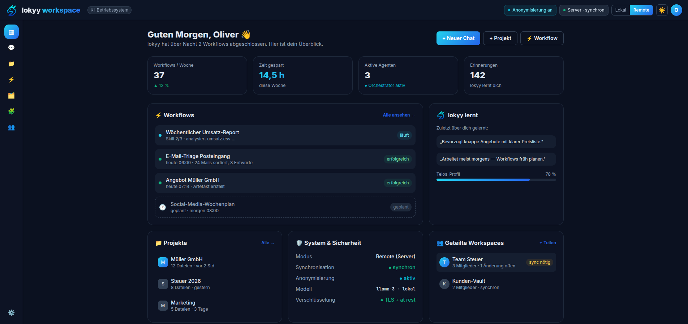

<p align="center">
  
</p>

<h1 align="center">lokyy workspace</h1>

<p align="center">
  <strong>The self-hosted AI operating system for the self-employed and SMEs — privacy-first, made in Germany.</strong>
</p>

<p align="center">
  🇬🇧 English &nbsp;·&nbsp; <a href="README.de.md">🇩🇪 Deutsch</a>
</p>

<p align="center">
  <a href="#license"></a>
  
  
  
  <br>
  
  
  
  
</p>

<p align="center">
  <a href="https://aiianer.de">🌐 Website</a> ·
  <a href="https://youtube.com/@aiianer">▶️ YouTube</a> ·
  <a href="https://skool.com/aiianer">👥 Community</a> ·
  <a href="docs/UMSETZUNGSPLAN.md">🗺️ Roadmap</a>
</p>

<p align="center">
  
</p>

---

> ⚠️ **Beta · Build in Public.** Lokyy is in active early development. We build it openly — every milestone, commit and decision happens in public. Follow along, give feedback, and shape it with us. Expect rough edges; the foundation is being laid right now.

## What is Lokyy?

**Lokyy Workspace** is not just another AI chat tool — it's a self-hosted **AI operating system**: the central platform where you run your entire AI-powered work. A **self-learning agent**, projects, files, automated workflows and skills come together like programs on an OS — running **completely locally on your machine** or **on your own server**.

It is an independent, clean-room implementation built for the **German / European market**: GDPR by default, EU hosting, German providers, real e-signatures — full data sovereignty.

## ✨ Features

- 🧠 **Self-learning agent** — knows you over time (Telos, `Soul.md`/`User.md`, Memory), keeps context clean via retrieval instead of bloat.
- 🤝 **Multi-agent orchestration** — an orchestrator that calls and parallelizes sub-agents.
- ⚡ **Workflows & skill chaining** — chained, scheduled, fully automated runs with artifacts + notifications.
- ◆ **Artifact panel** — live-rendered visualizations, diagrams, PDFs and code (sandboxed), like Claude.
- 🗂️ **Projects, file tree & native editor** — work on your files directly inside the system.
- 🛡️ **Data anonymization** — optional PII redaction (German patterns) before anything reaches a cloud model.
- 🔐 **Privacy by design** — local models, encryption at rest/in transit, real cryptographic (PAdES) signatures.
- 🔄 **Local ⇆ Server sync** — three modes (offline / hybrid / remote), offline-capable PWA, shared team workspaces.
- 📬 **Productivity suite** — mail, calendar/contacts, documents, notes — with German providers (mailbox.org, Posteo, Nextcloud …).

## 🇩🇪 Why Lokyy (for the German market)

Data sovereignty as a first-class feature: **GDPR by default**, EU hosting, German LLM/provider support, full German localization, real **eIDAS-grade** signatures, and accessibility (BFSG). Built for freelancers and SMEs who can't pour client data into US clouds.

## 🧱 Tech Stack

| Layer | Tech |
|-------|------|
| Frontend | TypeScript · Next.js (PWA) · Tailwind · shadcn/ui |
| Backend | Python · FastAPI |
| Database | PostgreSQL + pgvector |
| Infra | Docker (image parity local/server) |
| LLM | model-agnostic — local (Ollama/vLLM/llama.cpp) + cloud (Anthropic, OpenAI, Mistral-EU, Aleph Alpha …) |

## 🚀 Quick Start

> Coming soon — the foundation is under construction. Docker-based setup will land with the first milestone (M0).

```bash
git clone https://github.com/oliverhees/lokyy-workspace.git
cd lokyy-workspace
cp .env.example .env
docker compose up -d --build   # (available once M0 lands)
```

## 🗺️ Roadmap

Built in milestones M0–M8. Full detail in [`ROADMAP.md`](ROADMAP.md).

- 🟦 **M0 — Foundation & Setup** *(in progress)*
- ⬜ **M1 — Agent Core**
- ⬜ **M2 — Self-Learning Agent** — *MVP killer feature*
- ⬜ M3 — Projects, File Tree, Editor, Artifacts
- ⬜ M4 — Workflows & Multi-Agent
- ⬜ M5 — Privacy & Security
- ⬜ M6 — Productivity Suite
- ⬜ M7 — Sync & Team
- ⬜ M8 — Brand, Polish & Launch

## 📣 Build in Public

We're building Lokyy completely in the open. Follow the journey, ask questions, and contribute:

- 🌐 **Website:** https://aiianer.de
- ▶️ **YouTube:** https://youtube.com/@aiianer
- 👥 **Community:** https://skool.com/aiianer

## 🤝 Contributing

Contributions are welcome! Because Lokyy is dual-licensable (see below), all contributions require signing our **CLA** (see [`CLA.md`](CLA.md)). Start by reading the roadmap and opening an issue.

## 📜 License

Licensed under **AGPL-3.0-or-later** — see [`LICENSE`](LICENSE). Contributions are accepted under a **CLA** that allows future dual-licensing, so Lokyy can stay open **and** be offered commercially. Copyright belongs fully to the project (clean-room implementation — no third-party code adopted).

## ⭐ Star History

<a href="https://star-history.com/#oliverhees/lokyy-workspace&Date">
  
</a>
